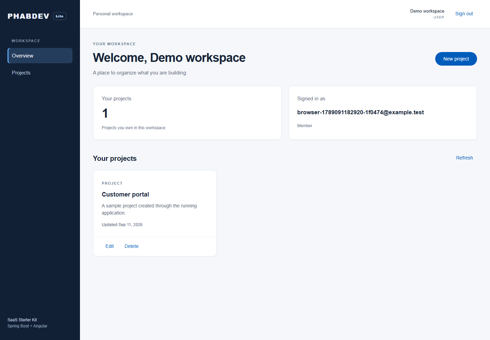

# PHABDEV Spring Boot + Angular SaaS Starter Lite

[](https://github.com/phabdev/spring-boot-angular-saas-starter-lite/actions/workflows/ci.yml)
[](LICENSE)
[](backend/pom.xml)
[](frontend/package.json)

An inspectable SaaS starter for teams that use **Spring Boot, Angular, PostgreSQL and Docker**. It includes a working authentication flow and an owner-scoped project CRUD, so you can evaluate the architecture from running code instead of a feature checklist.

This repository contains application source code, not a hosted SaaS. Free Lite is MIT licensed.

[Live product page](https://starter.phabdev.com/starter-kits/spring-boot-angular-saas-starter-kit/?utm_source=github&utm_medium=organic&utm_campaign=lite_repo) · [Compare Lite and Pro](https://starter.phabdev.com/pricing/?utm_source=github&utm_medium=organic&utm_campaign=lite_repo) · [Documentation](https://starter.phabdev.com/docs/starter-kit/?utm_source=github&utm_medium=organic&utm_campaign=lite_repo)



## What works

- Registration, login, logout and `/me`
- Short-lived JSON Web Tokens and rotating refresh cookies
- `USER` and `ADMIN` roles
- Create, read, update and delete projects with owner isolation
- PostgreSQL schema managed with Flyway
- OpenAPI documentation and health endpoint
- Angular Material interface with auth guards and responsive project screens
- Docker Compose setup plus native Java 21 and Node.js 24 workflows
- Backend, frontend and browser-oriented verification paths

## Lite and Pro

| Capability | Free Lite | Pro early access |
|---|---:|---:|
| Auth and rotating sessions | Included | Included |
| Owner-scoped project CRUD | Included | Included |
| PostgreSQL, Flyway and Docker | Included | Included |
| User administration and permission checks | Basic roles | Included |
| Audit history and user settings | — | Included |
| Password reset | — | Backend included; UI incomplete |
| Billing | — | Starter contains a test-mode scaffold; provider setup is required |
| License | MIT | Commercial |

Pro is a paid source package. Provider accounts, hosting and a production security guarantee are not included. Review the current scope and purchase terms on the [pricing page](https://starter.phabdev.com/pricing/?utm_source=github&utm_medium=organic&utm_campaign=lite_repo).

## Run with Docker

Requirements: Docker with Compose.

```bash
cp .env.example .env
node scripts/init-env.mjs
docker compose up --build
```

Open `http://localhost:4200`. The API health endpoint is `http://localhost:8080/actuator/health` and OpenAPI is available at `http://localhost:8080/swagger-ui.html`.

Use generated local credentials only. Do not commit `.env`.

## Run natively

Requirements: Java 21, Node.js 24 and PostgreSQL.

```bash
cd backend
./mvnw spring-boot:run
```

In another terminal:

```bash
cd frontend
npm ci
npm start
```

See [installation](docs/starter-kit/installation.md), [architecture](docs/starter-kit/architecture.md), [authentication](docs/starter-kit/auth.md) and [adding an entity](docs/starter-kit/add-new-entity.md) for the full workflow.

## Verify before building on it

```bash
cd backend
./mvnw verify

cd ../frontend
npm ci
npm test
npm run build
```

Backend integration tests use PostgreSQL Testcontainers, so Docker must be available. The public CI runs backend verification and frontend tests/build for every pull request.

## Feedback and contributions

Use [Issues](https://github.com/phabdev/spring-boot-angular-saas-starter-lite/issues) for reproducible bugs and [Discussions](https://github.com/phabdev/spring-boot-angular-saas-starter-lite/discussions) for setup questions and architectural feedback. Read [CONTRIBUTING.md](CONTRIBUTING.md) and [SECURITY.md](SECURITY.md) before contributing.

## License

Free Lite is available under the [MIT License](LICENSE). The paid Pro edition has separate commercial terms and is not part of this repository.

